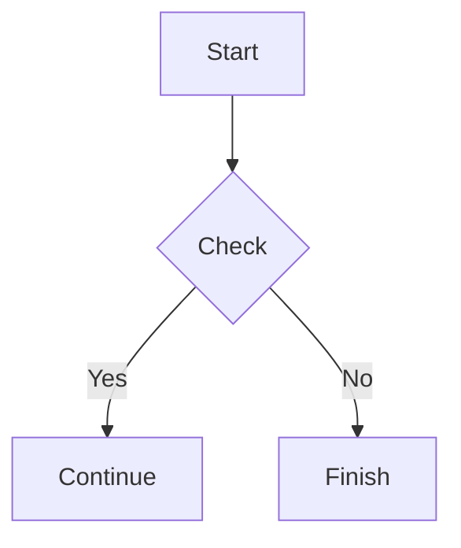

# Złoty MD (Desktop App)

**Złoty MD** is a modern Markdown editor designed with golden ratio-based layout principles and a Google-inspired color palette.
The desktop app version delivers a faster, more stable, and fully offline writing experience.

---

## 📥 Download

### Latest Version

| OS         | Download                                                             |
| ---------- | -------------------------------------------------------------------- |
| 🪟 Windows | [Download ZłotyMD Setup (.exe)](https://github.com/Rafych/ZlotyMD/releases) |
| 🍎 macOS   | [Download ZłotyMD (.dmg)](https://github.com/Rafych/ZlotyMD/releases)         |
| 🐧 Linux   | [Download ZłotyMD (.AppImage)](https://github.com/Rafych/ZlotyMD/releases)    |

---

## ⚡ Desktop App Features

### 🚀 High Performance

Runs locally with optimized rendering for smooth editing even with large documents.

### ✨ All free features are here!

Unlock features not available in the web version.

### 📐 Golden Ratio UI

Interface layout is designed using golden ratio proportions for better visual balance and readability.

### 🎨 Google-Inspired Design

Built with a Material Design-based color system for clarity and visual comfort.

---

## ✨ Supported Features

### Markdown Support

```md
# Heading
**Bold text**
*Italic text*
- List item
```

---

### 🧮 LaTeX Math Support

Inline expression:
$E = mc^2$

Block expression:

```tex
\int_{a}^{b} f(x)\,dx
```

---

### 📊 Mermaid Diagrams



---

### 💻 Code Highlighting

```javascript
function hello() {
    console.log("Hello, Złoty MD!");
}
```

---

## 🖥 System Requirements

* Windows 10 / 11 (64-bit)
* macOS 12 or later (Intel / Apple Silicon supported)
* Ubuntu 20.04+ (or equivalent Linux distributions)
* RAM: 4 GB minimum
* Storage: 300 MB available space

---

## 📦 Installation Guide

### Windows

1. Download the `.exe` installer
2. Run the file
3. Follow the installation wizard

### macOS

1. Open the `.dmg` file
2. Drag Złoty MD into the Applications folder
3. Launch the app and allow security permissions if required

### Linux

```bash id="linux-install"
sudo apt install zloty
```

---

## 🔄 Web vs Desktop

| Feature            | Web Version        | Desktop App |
| ------------------ | ------------------ | ----------- |
| Offline use        | ❌                  | ✅           |
| Performance        | Medium             | High        |
| Tools | Limited            | Full access |
| Stability          | Depends on browser | More stable |

---

## 👥 Who Is It For?

* Developers
* Technical writers
* Students and researchers
* Documentation authors
* Markdown enthusiasts

---

## 📂 Open Source

Złoty MD is an open-source project welcoming community contributions.

GitHub: [https://rafych.github.io/ZlotyMD/](https://rafych.github.io/ZlotyMD/)

---

## 📄 License

© 2026 Cybersecurity Department
Released under the MIT License.

---

## 🟡 Note

This page was also created using **Złoty MD**.

---
