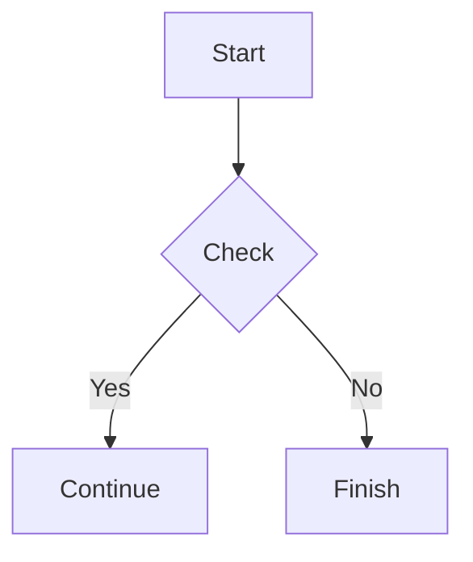

# Złoty MD

> **A Markdown editor with golden ratio proportions and a Google-style color palette.**

# [Open web editor](./ZlotyMD.html)
# [Download for Desktop](./app)

## About the project

**Złoty MD** is a modern web-based Markdown editor that combines writing convenience with the aesthetics of the golden ratio. The interface is inspired by Google’s color palette and is designed for comfortable work with technical documentation, notes, and publications.

## Features

### Markdown

Standard Markdown syntax is supported:

```md
# Heading
**Bold text**
*Italic*
- List
- Item
```

### LaTeX

The editor supports mathematical formulas via LaTeX.

Inline formulas:

```latex
E = mc^2
```

Block formulas:

```latex
\int_{a}^{b} f(x)\,dx
```

### Mermaid

Create diagrams directly inside the document.



### Code highlighting

Various programming languages are supported.

```javascript
function hello() {
    console.log("Hello, world!");
}
```

### Live preview

Instant real-time rendering of editing results.

## Design

* Interface proportions are based on the golden ratio.
* The color scheme is inspired by Material Design and Google’s palette.
* Responsive interface for desktop and mobile devices.
* Minimalist and user-friendly workflow.

## Who is it for?

* Developers
* Technical writers
* Students and researchers
* Documentation authors
* Markdown users

## Open source

The project is open source and welcomes community contributions.

---

## Copyright

© 2026 Cybersecurity Department. MIT License.
GitHub: https://github.com/Rafych/ZlotyMD

---

*This page was also created using Złoty MD.*
